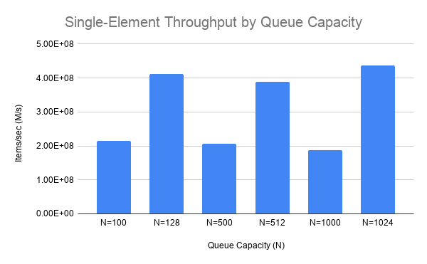
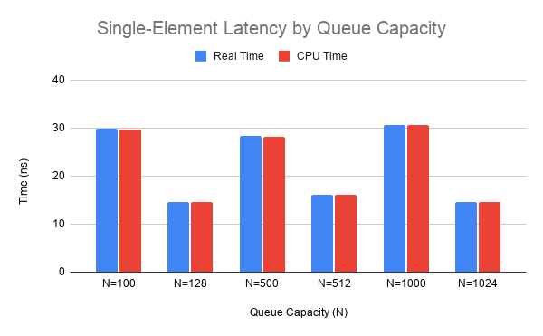
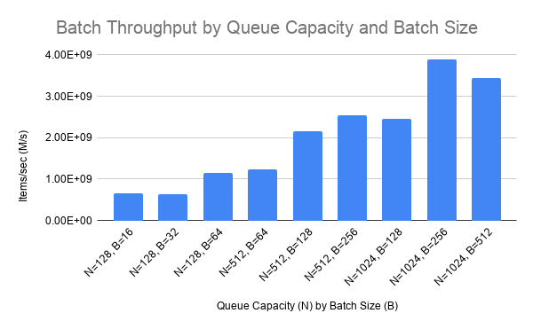
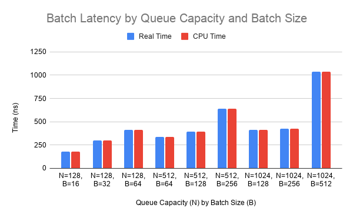

## Introduction

A header-only, low-latency Single-Producer Single-Consumer (SPSC) lock-free queue implemented in modern C++. Optimized for high throughput and real-time messaging.

## Design Highlights
* When using a power of 2 size for the queue, the implementation avoids using modulo arithmetic for the index wrapping and instead uses single-cyle bitwise `AND` operations.
* The queue stores the buffer, a read index, and a write index on separate cache lines (via `std::hardware_destructive_interference_size`)
* The queue provides support for batch processing via the `enqueueAll`/`dequeueAll` and `enqueueSome`/`dequeueSome` functions.
* For flexibility, dynamically allocated queues are supported. This flexibility comes at no cost when using a fixed size queue.
* Uses atomics as a form of efficient synchronization among the producer and consumer threads.
* Acquire/release and relaxed memory orderings were used whenever possible.

## Prerequisites
* Modern C++ compiler supporting C++20 or higher
* [CMake 3.23+](https://github.com/kitware/cmake)

## Benchmarks
The following benchmarks were retrieved on a system running Arch Linux x86_64, with an AMD Ryzen 7 5700U (16) @ 4.37 GHz CPU. No thread pinning or real-time scheduling was done. The metrics were the results retrieved after 10 runs. Results may vary. CPU frequency scaling was also disabled (via setting the CPU governor to `performance`).

Here are the throughput and latency metrics when strictly using `enqueue` and `dequeue` across two producer and consumer threads. 



Here are the throughput and latency metrics when strictly using `enqueueAll`/`dequeueAll` batch processing. Note that these results were similar to when using `enqueueSome`/`dequeueSome`, so for brevity, they are omitted here but still available for benchmarking on your own system. 



## Usage

### Initialization
The queue can be created either from a size specifed at compile time or runtime. Queues with a size specified at compile internally store data using `std::array<T, N>`. Queues with a size specified at runtime internally store the data using a `std::vector<T>`.

```cpp
#include "spsc.hpp"
auto queue = spsc::LockfreeSpscQueue<int, 1024>{};
```

Or:
```cpp
#include "spsc.hpp"
auto queue = spsc::LockfreeSpscQueue<int>{1024};
```

### Single Element
`enqueue` enqueues a single element into the queue. `dequeue` dequeues a single element from the queue. `enqueue` returns `true` if the operation was successful (otherwise false), and `dequeue` returns a `std::optional<T>` (`std::nullopt` if the queue was empty and the value otherwise).

### Batch Processing

`enqueueAll` can be used to enqueue all of the elements specified, or none at all if the queue cant fit all of them. `dequeueAll` provides the "same all or nothing" guarantees, but for when items are being dequeued. Both functions return `true` if the operation was successful. Otherwise, they return `false`.

```cpp
auto batch = std::array<int, 256>{};

// ... Populate `batch` ...

// All 256 items were enqueued
if (queue.enqueueAll({batch.data(), batch.size()}))
{
    // ...
}
else
{
    // ...
}
```

```cpp
auto batch = std::array<int, 256>{};

// 256 items were dequeued into `batch`
if (queue.enqueueAll({batch.data(), batch.size()}))
{
    // ...
}
else
{
    // ...
}
```

`enqueueSome` enqueues items into the queue, but allows for partial enqueues (i.e., not all the data has to be enqueued). `dequeueSome` works similarly but for dequeuing items from the buffer. These functions return a the number of elements that were enqueued or dequeued.

```cpp
auto batch = std::array<int, 256>{};

// ... Populate `batch` ...

// At least 32 items were enqueued
if (queue.enqueueSome({batch.data(), batch.size()}) >= 32)
{
    // ...
}
else
{
    // ...
}
```

```cpp
auto batch = std::array<int, 256>{};

// At least 32 items were dequeued
if (queue.dequeueSome({batch.data(), batch.size()}) >= 32)
{
    // ...
}
else
{
    // ...
}
```

### Utility Functions
Basic queue utility functions were also provided:
* `empty` - returns `true` if the queue is empty, otherwise `false`
* `full` - returns `true` if the queue is full, otherwise `false`
* `peek` - returns the next element to be dequeued without dequeuing it.
* `capacity` - returns the maximum number of elements that can fit into the queue.
* `size` - returns the number of elements in the queue.
* `free` - returns the amount of free space in the queue.

## Build
To build the performance suite to reproduce the throughput and latency metrics on your own setup, as well as the tests, run the following:

```bash
mkdir build && cd build
cmake .. -DCMAKE_BUILD_TYPE=Release
cmake --build .
```

The CMake options `BUILD_TESTS` and `BUILD_BENCHMARKS` were also provided. If you do not wish to run the tests, set `BUILD_TESTS` to `OFF`. Likewise, benchmarks can be disabled by setting `BUILD_BENCHMARKS` to `OFF` as well. By default, both options are set to `ON`.

The benchmarks will be located in the `benchmarks/` folder under the `build/` directory. Likewise, the tests will be in the `tests/` folder.

## License
This project is licensed under the MIT License - see the [LICENSE](LICENSE) file for more details.